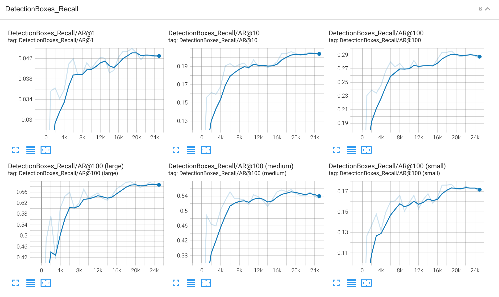

# Object Detection in an Urban Environment
## Project overview
For this project, we are going to build an object detection model based on the convolutional neural network for autonomous driving system. The architecture of this model is **SSD Resnet50**. we will use the data from waymo database, a dataset of urban environments which inculding vehicles, pedestrians and cyclists, and we will train the model on the tensorflow object detection API to detect and classify vehicles, pedestrians and cyclists.

Computer version is the core technology of self_driving system. Just like human eyes to detect and classify objects on the road and support self_driving car to make a correct decision on its own.

## Set up
I will use the classroom workspace, all the environment, necessary libraries and data are already available.
To run the code in this repository:

  - `step1`: **Exploratory data analysis**
  ```
  jupyter notebook --port 3002 --ip=0.0.0.0 --allow-root
  ```

  - `step2`: **create a split for train and val in waymo**
  ```
  python create_splits.py --data-dir /home/workspace/data/waymo
  ```

  - `step3`: **edit the config file**
  ```
  python edit_config.py --train_dir /home/workspace/data/waymo/train/ --eval_dir /home/workspace/data/waymo/val/ --batch_size 2 --checkpoint /home/workspace/experiments/pretrained_model/ssd_resnet50_v1_fpn_640x640_coco17_tpu-8/checkpoint/ckpt-0 --label_map /home/workspace/experiments/label_map.pbtxt
  ```

  - `step4`: **train and validation the model**

    - _train process_
    ```
    python experiments/model_main_tf2.py --model_dir=experiments/reference/ --pipeline_config_path=experiments/reference/pipeline_new.config
    ```

    - _validation process_
    ```
    python experiments/model_main_tf2.py --model_dir=experiments/reference/ --pipeline_config_path=experiments/reference/pipeline_new.config --checkpoint_dir=experiments/reference/
    ```

  - `step5`: **export the trained model**(Final model in experiment4)

  - `step6`: **create a video**

## Dataset
### Dataset analysis
  - For **EDA**: i have plotted 10 images from the dataset in `/home/workspace/data/waymo/training_and_validation` directory. we can clearly see some images have a good resolution, 
some images are blurry due to the weather condition and some images are deep dark. vehicles are in red bounding boxes, pedestrians are in green bounding boxes, cyclists are in blue bounding boxes.

   <div align=center>
      
   </div>

  - **Additional EDA**: from the statistic chart, obviously the dataset we've downloaded has a large number of vehicles and pedestrains, but very limited number of cyclists.
   
   <div align=center>
      
   </div>

### Cross validation
Since we already have 3 tfrecords available in the `/home/workspace/data/waymo/test` directory. We only need to split the data into `train` and `val` directory.
Totally we have 97 tfrecord in the `/home/workspace/data/waymo/trianing_and_val` directory. I will select **`80%:20%`** ratio to split. In order to avoid the overfitting occurs during 
the training, we should make sure the evenly distributed the data. We must **Random Shuffle** the data before splitting.

## Training
### Reference experiment
  - **Pretrained model**  
  
    - Model: **`ssd_resnet50_v1_fpn_640x640_coco17_tpu-8`**
    - Pipeline: [here](./experiments/reference/pipeline_new.config)
    
    The loss of model decreased but still too high. The precision and recall is very low, seems the model haven't learning much from trainset.

    ***Results displayed on the tensorboard***:

    | **Loss** | **Precision** |
    |     :---:     |     :---:      |
    |  |  |
    | **Recall** | **Learning_rate** |
    |  |  |

### Improve on the reference
  - **Experiment1** 
  
    - Model: **`ssd_resnet50_v1_fpn_640x640_coco17_tpu-8`**
    - Pipeline: [here](./experiments/experiment1/pipeline_new.config) 
  
    **Main changes vs Pretrained model**:
    ```
      1. Increase bacth_size: 2 --> 4
      2. Add data_augmentation
         * random_adjust_brightness
         * random_adjust_contrast
      3. Increase training_step: 2.5K --> 25K
     ```
    
    In order to get a quicker gradient descent, we can increase the batch size. And also in the realworld, the application will run in many different scenario. Apply data augmentation technology 
    can make the model generalized well. Extend the trainning step will drive the model reach to the optimal. As a result of increasing the batch size, the computational cost increased causing 
    OOM issue occurs in Udacity workspace. So I trained the model on google colab. Finally, we can see the loss of model decreased obvoiusly and the precision and recall also increased tremendously. 

    ***Results displayed on the tensorboard***: 

    | **Loss** | **Precision** |
    |     :---:     |     :---:      |
    |  |  |
    | **Recall** | **Learning_rate** |
    |  |  |

  - **Experiment2** 
  
    - Model: **`ssd_resnet50_v1_fpn_640x640_coco17_tpu-8`**
    - Pipeline: [here](./experiments/experiment2/pipeline_new.config) 
  
    **Main changes vs Experiment1**:
    ```
      1. Try different data_augmentation
         * random_adjust_brightness
         * random_rgb_to_gray
      2. Change optimizer: momentum --> adam
      3. Change learning rate: cosine_decay, base(0.04) --> Manual_step, base(0.002)
     ```
    
    Try different data_augmentation combination, different optimizer and learning rate, to see what effects will have. From the result, seems not much help with these changes.
  
    ***Results displayed on the tensorboard***:

    | **Loss** | **Precision** |
    |     :---:     |     :---:      |
    |  |  |
    | **Recall** | **Learning_rate** |
    |  |  |
    
  - **Experiment3** 

    - Model: **`ssd_resnet50_v1_fpn_640x640_coco17_tpu-8`**
    - Pipeline: [here](./experiments/experiment3/pipeline_new.config) 
  
    **Main changes vs Experiment2**:
    ```
      1. Increase batch_size: 4 --> 8
      2. Try different data_augmentation
         * random_adjust_brightness
         * random_adjust_contrast
         * random_rgb_to_gray
      3. Change learning rate: base(0.002) --> base(0.0002)
     ```
    
    Increase the batch size and reduce the learning rate try to avoid the oscillation of the learning curve. The train loss is convergence and precision and recall increased greatly.
    seems batch size have a great effect on the train results. But the model increased overfitting.

    ***Results displayed on the tensorboard***:

    | **Loss** | **Precision** |
    |     :---:     |     :---:      |
    |  |  |
    | **Recall** | **Learning_rate** |
    |  |  |

  - **Experiment4**

    - Model: **`ssd_resnet50_v1_fpn_640x640_coco17_tpu-8`**
    - Pipeline: [here](./experiments/experiment4/pipeline_new.config) 
  
    **Main changes vs Experiment1**:
    ```
      1. Increase batch_size: 4 --> 8
      2. Change learning rate: warmup(0.013333 --> 0.0002), base(0.04 --> 0.01)
    ```
    
    In order to validation the assumption above, try to increase the batch size based on experiment1, meanwhile reduce the learning rate. In the end, the result is very similar as the experiment3
    and can be acceptable. 
    To recap the above experiments, i think train with more data and train longer will improve the model performance.
       
    ***Results displayed on the tensorboard***:

    | **Loss** | **Precision** |
    |     :---:     |     :---:      |
    |  |  |
    | **Recall** | **Learning_rate** |
    |  |  |


 
 
